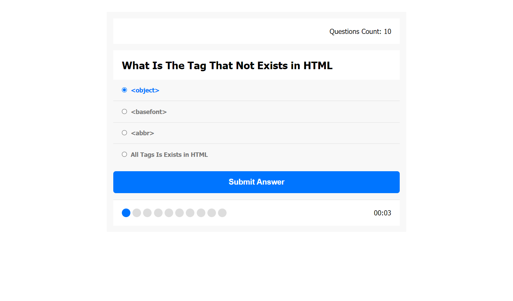

# Quiz App
**Quiz App** is a dynamic web application developed to sharpen my HTML and CSS skills. This project is centered around creating an engaging and interactive platform for users to test their knowledge on a specific material.

## Key Features
- **Material Selection**: Users can choose a specific material or topic to test their knowledge, offering a tailored quiz experience.
- **Multiple-Choice Questions**: The app presents a set of multiple-choice questions related to the selected material, challenging users with a variety of options to choose from.
- **Real-Time Feedback**: After answering each question, users receive immediate feedback on the correctness of their response, enhancing the learning experience.
- **Scoring System**: The app keeps track of users' scores, providing a cumulative result at the end of the quiz.
- **Result and Feedback**: Upon completion, users are presented with an overall result and categorized feedback such as "Bad," "Good," or "Perfect," giving them a clear understanding of their performance.

## Experience the Quiz Challenge
Explore the Quiz App to enjoy a personalized and interactive quiz experience. Select your preferred material, answer the multiple-choice questions, and receive instant feedback. Your insights and suggestions are welcome as I continue to refine and enhance this project.

**Happy quizzing!** 🧠🔍

